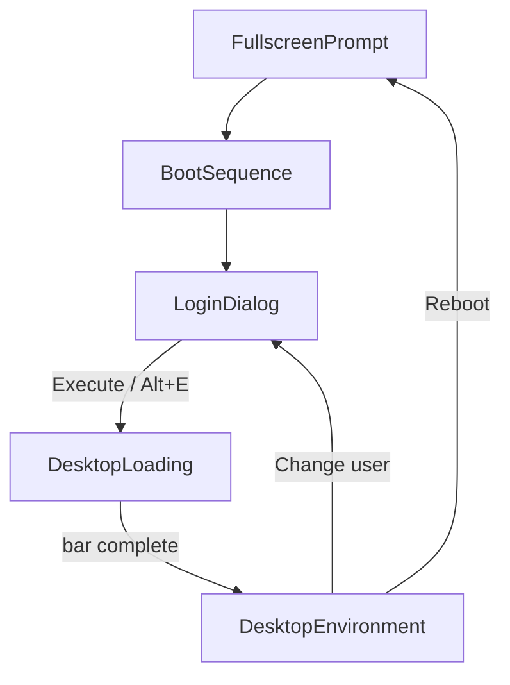

# BioReserve OS Desktop Shell

## Scope

Replace the Create Next App boilerplate on the root route with a phased shell that stays for the rest of the project. Leave empty `/auth/*` stubs, Supabase, and API routes untouched — they are out of scope.

**Defaults from your clarifications:**
- Login is UI-only; Execute always advances.
- Language and sound preferences persist (localStorage) for later wiring.
- Current user shows entered email, else `"Operator"`.
- Program window X closes the window and removes its taskbar button.

## Phase flow

Orchestrate phases in a single client state machine on the root page (no route changes for login/desktop):

- **Change user** → login only (no boot replay), per [BOOT-SEQUENCE.md](docs/design/BOOT-SEQUENCE.md).
- **Reboot** → restart from fullscreen prompt through the full sequence.
- Boot text is skippable via Enter or click.

## File layout

Compose under existing empty folders; keep `page.tsx` thin.

| Area | Files |
|------|--------|
| Root | [`src/app/page.tsx`](src/app/page.tsx) — mounts shell orchestrator |
| Layout / tokens | [`src/app/layout.tsx`](src/app/layout.tsx), [`src/app/globals.css`](src/app/globals.css) — VT323 + BioReserve CSS variables |
| Boot | `src/components/boot/FullscreenPrompt.tsx`, `BootSequence.tsx`, `DesktopLoading.tsx` |
| Auth UI | `src/components/boot/LoginDialog.tsx` |
| Desktop | `src/components/desktop/Desktop.tsx`, `DesktopIcon.tsx`, `Taskbar.tsx`, `StartMenu.tsx`, `LanguageMenu.tsx` |
| Window system | `src/components/desktop/Window.tsx`, `windowManager` state/hook (open/focus/close/drag/z-order; one instance per program id) |
| Programs | `src/components/programs/{Reports,Archive,SpeciesDatabase,Assistant,Personnel}App.tsx` — empty placeholder bodies |
| Shared chrome | `src/components/ui/Win95Button.tsx` (bevelled button used by login + taskbar) |

## Visual system

Update [`globals.css`](src/app/globals.css) with tokens from [ui-style.mdc](.cursor/rules/ui-style.mdc):

- Window/taskbar bg `#3A3737`, text `#FAF6ED`, deep blue title bars, muted grey-green accent, bevel borders.
- Load **VT323** via `next/font/google` for boot sequence text; use a restrained system/pixel-friendly stack for desktop chrome (not Geist/SaaS styling).
- Metadata title → BioReserve OS.

## 1. Boot sequence

**Fullscreen prompt** — black overlay, exact copy from BOOT-SEQUENCE.md; Enter Fullscreen calls `document.documentElement.requestFullscreen()` then continues; Continue Windowed continues immediately.

**Boot messages** — black full viewport, VT323, warm off-white (`#FAF6ED`). Reveal the exact message block line-by-line with authentic pacing; Enter/click skips to completion then shows login.

**Login (`Authentication.exe`)** — black background; single dialog slightly above center; blue title bar; greyed disabled X. Form: email, password, Google OAuth button (no-op), then Win95 **Create User** (`Alt+C`, no-op) and **Execute** (`Alt+E` / click → store email for Current user, go to loading). Inputs do not validate.

**Desktop loading** — `public/images/loading-screen.png` stretched to fill the full viewport (`width`/`height` 100%, equivalent to `object-fit: fill`). Allow distortion; do **not** use cover/contain cropping so logo and text stay fully visible. Overlay a dark green progress bar near the bottom; fill slowly (~3–4s CSS animation or interval); on complete → desktop.

## 2. Desktop environment

**Wallpaper** — `public/images/background-desktop.png` cover the viewport (desktop-sized).

**Icons** (column of 4 + one in column 2), top-left downward, assets from `public/icons/`:

1. Reports.exe → `reports.png`
2. Archive.exe → `archive.png`
3. Species_Database.exe → `species-database.png`
4. Assistant.exe → `assistant.png`
5. Personnel.exe → `personnel.png`

Click opens (or focuses if already open) the matching program window. No duplicates.

**Windows** — shared `Window` chrome: bevelled frame, blue title bar with program title + working X, inactive (greyed) when not focused. Drag by title bar; click content/title focuses and raises z-index. Body renders the empty placeholder program component.

**Taskbar buttons** — while a program is open, show a button with that program’s title; click focuses/raises that window. Closing via X removes the button.

## 3. Taskbar

Fixed bottom bar (`#3A3737`), Win95-style:

- **Start** (left) → menu: Current user (label only: email or `"Operator"`); Change user → login phase; Reboot → full sequence from fullscreen prompt.
- **Tray** (right): language control → small menu English / Dutch (Nederlands); persist preference (`localStorage`, e.g. `bioreserve-locale`); sound on/off icon toggle; persist boolean (`bioreserve-sound-enabled`); clock showing local day/month and **always year `1993`**, format `dd//mm//1993` (display-only — do not mutate `Date`).

## Root composition

[`page.tsx`](src/app/page.tsx) becomes a client shell (or a thin server page wrapping `BioReserveShell`) that owns:

- `phase`: `fullscreen` | `boot` | `login` | `loading` | `desktop`
- `displayName` / email string for Current user
- locale + sound state (hydrated from localStorage after mount)
- window manager state passed into `Desktop`

No separate `page.tsx` per program.

## Out of scope (explicit)

- Real auth, Google OAuth, Supabase, Create User behaviour
- Translations beyond storing locale
- Actual audio
- Program content beyond empty windows
- Animations beyond boot line reveal, loading bar fill, and necessary open/focus behaviour
