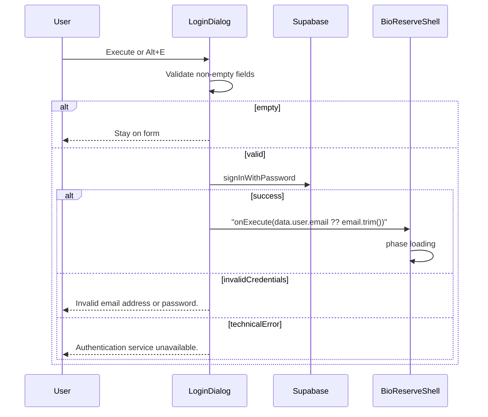

# Email/password login for Authentication.exe

## Current state

- Boot flow in [`src/components/desktop/BioReserveShell.tsx`](src/components/desktop/BioReserveShell.tsx): `fullscreen` → `boot` → `login` → `loading` → `desktop`.
- [`LoginDialog`](src/components/boot/LoginDialog.tsx) is UI-only: `onExecute(email)` advances immediately; password is unused; Alt+E mirrors Execute; Create User / Google are no-ops.
- [`src/lib/supabase.ts`](src/lib/supabase.ts) and [`src/hooks/useAuth.ts`](src/hooks/useAuth.ts) are empty stubs.
- No `@supabase/supabase-js` / `@supabase/ssr` in dependencies (only the `supabase` CLI).
- Env placeholders already exist: `NEXT_PUBLIC_SUPABASE_URL`, `NEXT_PUBLIC_SUPABASE_PUBLISHABLE_KEY`.

**Approach (chosen):** browser-only Supabase client + auth call inside `LoginDialog`. No middleware, cookie SSR helpers, or `useAuth` refactor this milestone.

## Implementation

### 1. Add client dependency and fill `src/lib/supabase.ts`

- Install `@supabase/supabase-js`.
- Export a browser client factory (or singleton) that reads and **validates at runtime**:
  - `process.env.NEXT_PUBLIC_SUPABASE_URL`
  - `process.env.NEXT_PUBLIC_SUPABASE_PUBLISHABLE_KEY`
- If either is missing/empty, throw a clear configuration error (developer-facing, not shown as raw text to the login UI). LoginDialog will catch unexpected failures and map them to the service-unavailable user message.
- Leave [`useAuth.ts`](src/hooks/useAuth.ts) untouched (empty).

### 2. Authenticate inside [`LoginDialog.tsx`](src/components/boot/LoginDialog.tsx)

Keep layout, Win95 styling, Alt+C no-op, and Alt+E → same path as Execute.

**Form attributes**

- Email input: `autoComplete="email"` (replace current `"username"`).
- Password input: `autoComplete="current-password"` (already present; keep).

**State and submit path**

- Local state: `error`, `isSubmitting`.
- Shared `attemptLogin()` used by form submit and Alt+E:
  1. If email (trimmed) or password is empty, do not call Supabase; stay on form (block submit / ignore shortcut while empty). No password logging.
  2. Set `isSubmitting`, clear prior error, call `supabase.auth.signInWithPassword({ email: email.trim(), password })`.
  3. **Success:** call `onExecute(data.user.email ?? email.trim())` so Shell advances to `DesktopLoading`.
  4. **Credential rejection** (Supabase auth error such as invalid login): show exactly  
     `Invalid email address or password.`
  5. **Reachability / unexpected technical failure** (network errors, missing env throwing from client init, non-auth exceptions): show exactly  
     `Authentication service unavailable. Please try again.`
  6. Always clear `isSubmitting` in `finally`.
- **Never** surface raw Supabase `error.message` (or codes) in the UI.
- **Never** log, store, or persist the password (no `console.log` of form state that includes password; password stays in React state only for the request).
- While `isSubmitting`: disable Execute, ignore repeat Alt+E; keep visual design unchanged.
- Show the mapped error in existing dialog chrome (compact text near the fields/buttons)—no new visual language.

### 3. Leave Shell phase logic as-is

[`handleExecute`](src/components/desktop/BioReserveShell.tsx) already sets user display name and `phase: "loading"`. It will receive the authenticated email from step 2; no Shell changes required.

### 4. Out of scope (explicitly not done)

- Create User / registration
- Google OAuth
- Session restore / skip login when already signed in
- Middleware, RLS, `@supabase/ssr` cookie clients
- Filling `useAuth.ts` or auth route pages under `src/app/auth/`

## Verification

- Empty email/password: no network auth call; stay on login.
- Wrong password: stay on login; message `Invalid email address or password.`
- Unreachable Supabase / thrown client config error: `Authentication service unavailable. Please try again.`
- Correct credentials: advance to DesktopLoading; display name uses `data.user.email ?? email.trim()`.
- Double-click Execute / rapid Alt+E while loading: only one in-flight attempt.
- Password never appears in logs or persisted storage beyond the in-memory input state.
- Visuals and Alt+C / Alt+E behaviour otherwise unchanged.
