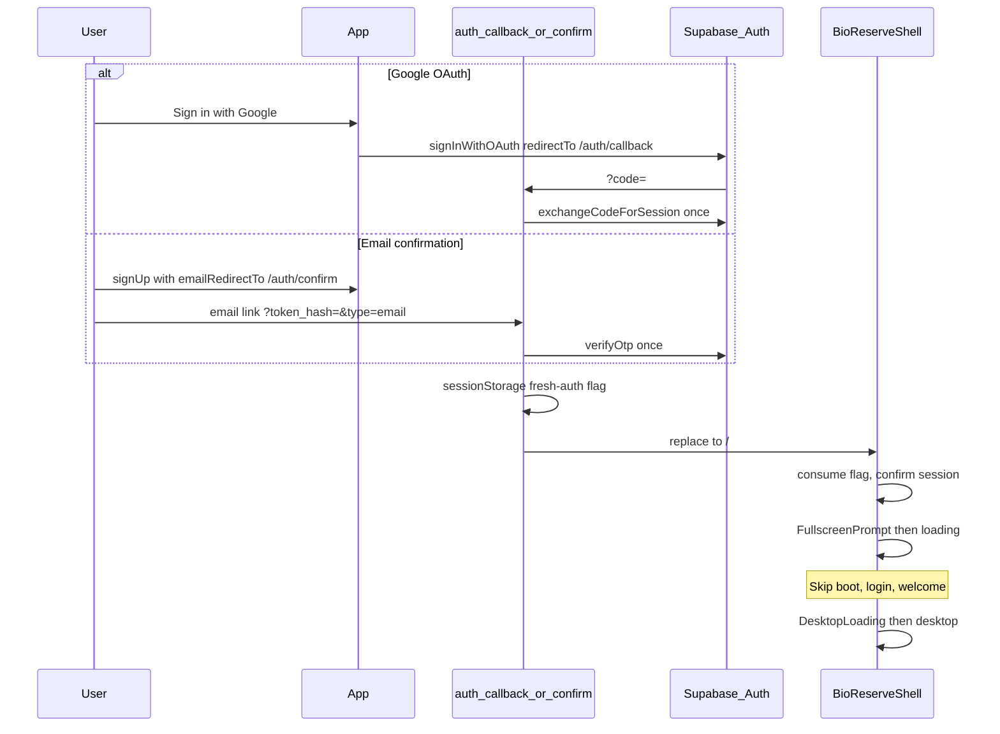

# Google OAuth + email confirmation (PKCE)

## Authentication-flow choice (revised)

**Hosted Supabase has Confirm email enabled.** That affects both registration and callback design:

| Flow | Callback route | Exchange API | Query params |
|------|----------------|--------------|--------------|
| Google OAuth (PKCE) | `/auth/callback` | `exchangeCodeForSession(code)` | `code` (and optional OAuth `error`) |
| Email signup confirmation (PKCE) | `/auth/confirm` | `verifyOtp({ token_hash, type })` | `token_hash`, `type=email` |

These must **never** be mixed: `/auth/callback` ignores `token_hash`/`type`; `/auth/confirm` ignores `code`. Email confirmation is **not** a Google OAuth callback.

**Why PKCE for the browser client:** With hosted confirm-email enabled, Supabase’s current guidance treats OAuth and email signup confirmation as PKCE-capable flows. The JS client should use `flowType: 'pkce'` so `signInWithOAuth` receives an auth `code` on `/auth/callback`. Email confirmation uses the separate **`token_hash` + `verifyOtp`** path documented for PKCE signup ([Password-based Auth — PKCE flow](https://supabase.com/docs/guides/auth/passwords?flow=pkce)), not `exchangeCodeForSession`.

**Why not `detectSessionInUrl: true`:** Exchange is explicit on dedicated callback pages only. The root `/` never auto-processes URL auth params, avoiding confusion between OAuth codes and email tokens.



---

## Architecture (browser-only, unchanged principles)

- No `@supabase/ssr`, no middleware, no server callback routes.
- Session in Supabase JS client storage; [`resolveAuthSession`](src/lib/sessionUser.ts) remains authoritative.
- **Generic** one-time fresh-auth flag (not Google-specific) shared by OAuth and email confirmation success.
- **Distinct error flags:** Google OAuth failures use an OAuth-only flag; email confirmation failures use a separate confirm-only flag — never Google-specific copy or flags for email confirm.

---

## External configuration (hosted Supabase project only)

This milestone uses the **hosted Supabase project** in the Dashboard. There is **no** local Supabase CLI setup (`supabase start`, `config.toml` provider blocks, etc.) in scope.

### 1. Google Cloud (Google Auth Platform)

Per [Supabase Google auth docs](https://supabase.com/docs/guides/auth/social-login/auth-google):

1. Create/select project; configure OAuth consent screen and required scopes: `openid`, `userinfo.email`, `userinfo.profile`.
2. **Credentials → OAuth client ID → Web application**
   - **Authorized JavaScript origins:** the local dev origin(s) you use (`http://localhost:3000` and/or `http://127.0.0.1:3000`).
   - **Authorized redirect URIs:** `https://<project-ref>.supabase.co/auth/v1/callback` only (Supabase endpoint, not the app).
3. Copy Client ID and Client Secret into Supabase.

### 2. Supabase Dashboard — URL Configuration (development milestone)

There is **no production URL yet.** Configure for local development now; document deployment follow-up separately.

**Site URL (now):** set to the **primary local development origin** — the same origin you actually open in the browser (e.g. `http://localhost:3000`). Pick one primary; use it consistently in Google JS origins, Site URL, and `window.location.origin` during dev.

**Redirect URLs allow list (now):** add the local callback paths used by the app:

| URL |
|-----|
| `http://localhost:3000/auth/callback` |
| `http://localhost:3000/auth/confirm` |
| `http://127.0.0.1:3000/auth/callback` |
| `http://127.0.0.1:3000/auth/confirm` |

Include both `localhost` and `127.0.0.1` if either may be used during development.

**After deployment (document only — do not configure now):**

1. Change **Site URL** from the local origin to the real production URL.
2. Add the **exact** production callback URLs to the Redirect URLs allow list, e.g. `https://<your-production-host>/auth/callback` and `https://<your-production-host>/auth/confirm` (replace with the actual host when it exists).
3. Add the production origin to Google Cloud **Authorized JavaScript origins**.
4. Re-test OAuth and email confirmation on production.

Do not invent or placeholder a production URL in code or Dashboard config during this milestone.

**Email confirmation links:** the Confirm signup template uses `{{ .SiteURL }}/auth/confirm?...`, so during development confirmation links target the local Site URL host — consistent with local-only setup.

### 3. Supabase Dashboard — Google provider

Enable Google; paste Client ID and Client Secret.

### 4. Supabase Dashboard — Confirm signup email template (required for PKCE email)

With confirm email enabled, update the **Confirm signup** template to the PKCE pattern from [Password-based Auth](https://supabase.com/docs/guides/auth/passwords?flow=pkce):

```html
<h2>Confirm your email address</h2>
<p>Follow the link below to confirm this email address and finish signing up.</p>
<p>
  <a
    href="{{ .SiteURL }}/auth/confirm?token_hash={{ .TokenHash }}&type=email&next={{ .RedirectTo }}"
  >Confirm email address</a>
</p>
```

This ensures email links land on `/auth/confirm` with `token_hash`, not on `/auth/callback` with a `code`.

---

## Code changes

### 1. Supabase browser client — PKCE

Update [`src/lib/supabase.ts`](src/lib/supabase.ts):

```ts
createClient(url, publishableKey, {
  auth: {
    flowType: "pkce",
    detectSessionInUrl: false,
    persistSession: true,
    autoRefreshToken: true,
  },
});
```

### 2. Auth return helpers

Add e.g. [`src/lib/authReturn.ts`](src/lib/authReturn.ts):

**SessionStorage keys (versioned):**

| Key | Purpose |
|-----|---------|
| `bioreserve:fresh-auth:v1` | One-time “just authenticated” (OAuth **or** email confirm). Consumed on `/`. Not Google-specific. |
| `bioreserve:oauth-error:v1` | One-time failed/cancelled **Google OAuth only**. Consumed on `/` → login + Google generic error. |
| `bioreserve:email-confirm-error:v1` | One-time failed **email confirmation only**. Consumed on `/` → login + email generic error. Never used for OAuth. |

**URL helpers:**

- `getOAuthCallbackUrl()` → `` `${window.location.origin}/auth/callback` ``
- `getEmailConfirmRedirectUrl()` → `` `${window.location.origin}/auth/confirm` ``

**Flag helpers:** `markFreshAuth()`, `consumeFreshAuth()`, `markOAuthError()`, `consumeOAuthError()`, `markEmailConfirmError()`, `consumeEmailConfirmError()`.

**OAuth initiation:** `signInWithGoogle()` wrapping `signInWithOAuth({ provider: 'google', options: { redirectTo: getOAuthCallbackUrl() } })`.

**Generic errors (no provider-specific copy on success paths):**

- Google failure (login): `Unable to sign in with Google. Please try again.`
- Email confirm failure: `Unable to confirm your email. Please try again.` (or equally generic; not Google-branded)

### 3. Once-only / in-flight exchange guard (React Strict Mode)

Auth codes and OTP tokens are **single-use**. Implement a **concrete module-level guard** in [`src/lib/authReturn.ts`](src/lib/authReturn.ts) (or adjacent helper) so each callback param set is exchanged **at most once**, including when React Strict Mode re-runs effects:

```ts
const exchangeState = new Map<string, "in-flight" | "done">();

export function tryBeginExchange(key: string): boolean {
  const existing = exchangeState.get(key);
  if (existing === "in-flight" || existing === "done") return false;
  exchangeState.set(key, "in-flight");
  return true;
}

export function finishExchange(key: string): void {
  exchangeState.set(key, "done");
}
```

Callback pages call `tryBeginExchange` **before** any Supabase API call; if it returns `false`, skip exchange and rely on existing session / redirect logic. On completion (success or failure), mark `done` so a Strict Mode re-run cannot call `exchangeCodeForSession` or `verifyOtp` again with the same `code` or `token_hash`.

Optional belt-and-suspenders: persist `"done"` for the exchange key in `sessionStorage` for the current tab if the module Map is insufficient across HMR — prefer the Map first; add storage only if needed during verification.

- **`/auth/callback`:** key = `` `oauth:${code}` `` → guarded `exchangeCodeForSession(code)`.
- **`/auth/confirm`:** key = `` `email:${token_hash}:${type}` `` → guarded `verifyOtp({ token_hash, type })`.

**Misroute handling:**

- `/auth/callback` with `token_hash`/`type` but no OAuth `code`: do **not** exchange; redirect `/` without fresh-auth (optionally OAuth error only if user clearly came from Google flow).
- `/auth/confirm` with OAuth `code` only: do **not** call `exchangeCodeForSession`; `markEmailConfirmError()` → `/`.

**Outcomes:**

- OAuth `error` param on `/auth/callback` → `markOAuthError()`, `replace('/')`.
- OAuth success → `markFreshAuth()`, `replace('/')`.
- OAuth exchange failure → `markOAuthError()`, `replace('/')`.
- Email confirm success → `markFreshAuth()`, `replace('/')`.
- Email confirm failure → `markEmailConfirmError()`, `replace('/')` (never `markOAuthError`).

UI during exchange: black hold only (`h-dvh w-full bg-black`, same as `awaitingSession`) — no new visual design.

Wrap pages using `useSearchParams` in `<Suspense>`.

### 4. `/auth/callback` — Google OAuth only

Add [`src/app/auth/callback/page.tsx`](src/app/auth/callback/page.tsx) (client):

1. Read `code`, `error` from search params.
2. Reject/ignore `token_hash`, `type` (misrouted email links should use `/auth/confirm`).
3. Run guarded `exchangeCodeForSession(code)`.
4. Success → `markFreshAuth()` → `replace('/')`.
5. Failure/cancel → `markOAuthError()` → `replace('/')`.

### 5. `/auth/confirm` — email confirmation only

Add [`src/app/auth/confirm/page.tsx`](src/app/auth/confirm/page.tsx) (client):

1. Read `token_hash`, `type` from search params (expect `type=email` for signup).
2. Ignore bare `code` without email params (misrouted OAuth).
3. Run guarded `verifyOtp({ token_hash, type })`.
4. Success → `markFreshAuth()` → `replace('/')` (ignore or sanitize `next` — prefer always `/` for consistent shell handling).
5. Failure → redirect `/` with consumable generic confirm error → shell shows **LoginDialog** with generic message (no Google copy, no welcome).

### 6. RegisterDialog — `emailRedirectTo`

Update [`src/components/boot/RegisterDialog.tsx`](src/components/boot/RegisterDialog.tsx) `signUp` call:

```ts
await supabase.auth.signUp({
  email: trimmedEmail,
  password,
  options: {
    emailRedirectTo: getEmailConfirmRedirectUrl(),
  },
});
```

Existing “Check your email” UI unchanged. Still no `onExecute` until a session exists (confirm email enabled).

### 7. LoginDialog — Google button (no UI changes)

Update [`src/components/boot/LoginDialog.tsx`](src/components/boot/LoginDialog.tsx):

- Wire existing Google button to `signInWithGoogle()` with `isSubmitting` guards.
- Optional `initialError?: string | null` prop for return errors from shell (OAuth or email confirm — distinct messages set by shell).
- No markup, styling, or label changes.

### 8. BioReserveShell — fresh-auth routing (approved UX)

Update [`src/components/desktop/BioReserveShell.tsx`](src/components/desktop/BioReserveShell.tsx):

**One-time mount effect (before normal boot):**

```
if consumeOAuthError():
  loginInitialError = Google generic message
  phase = login
  return

if consumeEmailConfirmError():
  loginInitialError = email generic message  // not Google copy
  phase = login
  return

if consumeFreshAuth():
  result = await resolveAuthSession()
  if not authenticated:
    loginInitialError = generic message
    phase = login
    return
  set sessionStatus authenticated, currentUser, non-blocking enrichDisplayName
  // Fullscreen: OAuth navigation normally exits fullscreen — FullscreenPrompt is expected
  if document.fullscreenElement:  // defensive edge case only
    phase = loading
  else:
    freshAuthReturnPending = true
    phase = fullscreen
  return

// default: phase fullscreen → normal boot cycle (restored session → boot → welcome)
```

**FullscreenPrompt branch:**

```tsx
<FullscreenPrompt
  onContinue={
    freshAuthReturnPending
      ? () => { setFreshAuthReturnPending(false); setPhase("loading"); }
      : startBootCycle
  }
/>
```

**Explicitly skipped for fresh auth (OAuth or email confirm):** BootSequence, LoginDialog, WelcomeBackDialog.

**Unchanged:** email/password `handleExecute` → loading; restored session without fresh-auth flag → fullscreen → boot → welcome; Change User; Reboot; config/auth errors.

---

## Fullscreen behaviour

Google OAuth navigation **normally exits fullscreen**. Treat **FullscreenPrompt as the expected successful return path** after both Google OAuth and email confirmation (fresh-auth flag consumed).

| Scenario | Behaviour |
|----------|-----------|
| Fresh auth return, fullscreen lost (expected) | FullscreenPrompt → DesktopLoading → desktop |
| Fresh auth return, fullscreen still active (defensive edge case) | Skip prompt → `loading` → desktop |

Do not replay BootSequence on fresh-auth return.

---

## Security and UX notes

- Fresh-auth flag is generic — refresh after consume uses normal restored-session flow (boot + welcome).
- Never surface raw Supabase/Google error strings.
- Google `full_name` → `profiles.display_name` via existing [`handle_new_user`](supabase/migrations/20260719160050_initial_main_schema.sql); `enrichDisplayName` runs after fresh auth.
- PKCE OAuth `code` validity: 5 minutes, single use — guard prevents double exchange on Strict Mode reruns.

---

## Verification

1. **Google OAuth success:** callback → `/` → FullscreenPrompt → DesktopLoading → desktop (no boot/login/welcome).
2. **Google OAuth + defensive fullscreen:** if `document.fullscreenElement` set, skip prompt → loading.
3. **Google cancel/failure:** login with Google generic error; no boot.
4. **Email confirm success:** `/auth/confirm` → `/` → same fresh-auth path as OAuth; no Google message or flag.
5. **Email link on `/auth/callback`:** not treated as OAuth; no erroneous exchange.
6. **OAuth `code` on `/auth/confirm`:** not treated as email confirm.
7. **Strict Mode dev:** callback/confirm effects do not double-call exchange APIs.
8. **Refresh after fresh auth:** normal restored session (boot + welcome) because flag consumed.
9. **Email/password login:** unchanged.
10. **Development URL config:** Site URL is the primary local origin; local `/auth/callback` and `/auth/confirm` are on the Redirect URLs allow list.
11. **Deployment note documented:** after production URL exists, update Site URL and add exact production callback URLs (no placeholder production URL in this milestone).
