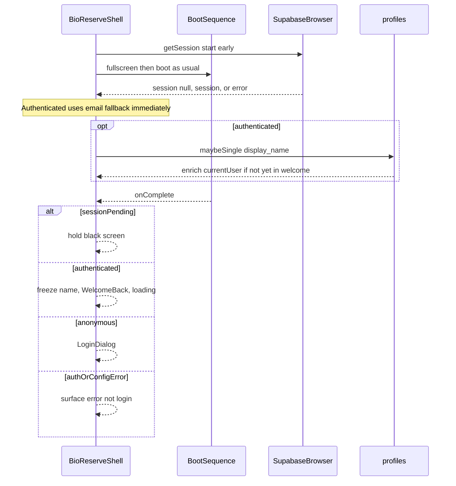

# Session restoration after boot

## Architecture (browser-only, no SSR change)

Stay on the existing client Supabase singleton in [`src/lib/supabase.ts`](src/lib/supabase.ts). Session lives in the browser client storage; `getSession()` + `signOut({ scope: "local" })` meet the requirements. No middleware, cookies, or `@supabase/ssr`.

**Why a small schema addition is needed:** [`profiles` has RLS enabled with no policies](supabase/migrations/20260719160050_initial_main_schema.sql) (“Policies deliberately come in a later migration”). Without a SELECT policy, `display_name` can never load. Add one migration allowing authenticated users to `select` their own row. That is required for the display-name requirement; it is not route protection or broader auth work.



## Phase flow in [`BioReserveShell.tsx`](src/components/desktop/BioReserveShell.tsx)

Extend phases:

- existing: `fullscreen` → `boot` → `login` | **`welcome`** → `loading` → `desktop`
- session resolution state (separate from UI phase):
  - `sessionStatus: "pending" | "authenticated" | "anonymous" | "config_error" | "auth_error"`
  - `currentUser` (may enrich after auth, except while welcome is showing a frozen label)
  - `welcomeDisplayName` — snapshot frozen when entering `welcome`
  - optional `authError` for config / getSession / Change User failures

### Session vs profile (two steps)

**1. Session resolution (gates login vs welcome):**

- Start early when entering the boot path (see Reboot below)—**do not** await before showing fullscreen/boot visuals.
- Call `getSupabaseBrowserClient().auth.getSession()`.
- Classify the result explicitly:
  - **`session === null` and no error** → `sessionStatus = "anonymous"` → LoginDialog after boot.
  - **Valid `session` with user** → `sessionStatus = "authenticated"` immediately; set `currentUser` to `user.email` if present else `"User"`.
  - **Unexpected `getSession()` error** → `sessionStatus = "auth_error"` (not anonymous); show an appropriate error after boot—not LoginDialog.
- Note: `getSession()` refreshes an expired access token when possible. Do **not** treat “expired access token alone” as anonymous; rely on the API result (session present after refresh vs null vs error).
- **Do not** treat missing env vars or `getSupabaseBrowserClient()` init failures as anonymous. Use `sessionStatus = "config_error"`; show an appropriate error after boot (not LoginDialog).

**2. Profile enrichment (non-blocking):**

- After authentication is known, fetch `display_name` with:

```ts
.from("profiles")
.select("display_name")
.eq("id", userId)
.maybeSingle()
```

- Missing row / soft failure → keep email/`User` fallback; never block desktop entry.
- On success with non-empty name: update `currentUser` **only if** the shell is not currently showing WelcomeBack with a frozen label (see below).
- Never stall the 2s welcome or DesktopLoading on the profile request.

### After boot `onComplete`

- If `sessionStatus === "pending"`: full-viewport black hold—**not** LoginDialog—until session resolution finishes, then branch.
- If `"authenticated"`: **freeze** `welcomeDisplayName = currentUser` at this moment, go to `welcome`. Late profile enrichment must **not** change the WelcomeBack message while that dialog is displayed (it may still update `currentUser` for the taskbar after welcome completes / during loading→desktop).
- If `"anonymous"`: go to `login`.
- If `"config_error"` or `"auth_error"`: show error; do not send the user to LoginDialog.

**Welcome:** ~2000ms timer → `loading` → existing `DesktopLoading` → `desktop`. Pass the frozen `welcomeDisplayName` into WelcomeBackDialog.

**Fresh login:** `LoginDialog` → `onExecute` → set `currentUser` from email → `loading`. **Also** start the same non-blocking profile enrichment so the desktop can show `display_name` without waiting for a full reload.

### Reboot: explicitly rerun session restoration

[`handleReboot`](src/components/desktop/BioReserveShell.tsx) keeps `BioReserveShell` mounted (`phase` → `fullscreen`). A mount-only session effect would **not** re-run.

**Chosen behaviour:** Reboot **explicitly reruns** session restoration when the boot path starts again (e.g. when transitioning `fullscreen` → `boot`, or via a `sessionCheckId` / reboot generation counter that the session effect depends on).

- Reset `sessionStatus` to `"pending"` for that cycle so post-boot branching waits correctly.
- Preserve the workstation’s local Supabase session (no sign-out on reboot); restoration should find the same session again and show welcome after boot.
- Do not rely solely on “state still in memory from the previous cycle” for the post-boot decision—re-check `getSession()`.

### Change User

Use:

```ts
await supabase.auth.signOut({ scope: "local" })
```

- On **success** (local session cleared): `resetWindows()`, clear auth/session UI state, set `sessionStatus` to `"anonymous"`, reset display name, `setPhase("login")`.
- On **failure**: do **not** navigate to LoginDialog; keep the current phase/desktop state; show an appropriate error. Only return to login when sign-out has actually cleared the local session.

### Effect / timer cleanup

- Session restoration effect: abort or ignore stale results on cleanup (cancelled flag / AbortController where applicable); clear when reboot increments the check generation.
- [`WelcomeBackDialog`](src/components/boot/WelcomeBackDialog.tsx): clear the ~2s `setTimeout` in `useEffect` cleanup on unmount so it cannot fire after leaving welcome.

## New UI: `WelcomeBackDialog`

Add [`src/components/boot/WelcomeBackDialog.tsx`](src/components/boot/WelcomeBackDialog.tsx):

- Same chrome as Authentication.exe: bevelled window, title bar, black fullscreen backdrop—compact body: `Welcome back, {displayName}!`
- Props: `displayName` (frozen snapshot from the shell), `onComplete`.
- ~2s timeout then `onComplete`, with timer cleanup on unmount.
- No new design language; no login form controls.

## Helpers (keep shell thin)

Prefer two small functions in e.g. [`src/lib/sessionUser.ts`](src/lib/sessionUser.ts):

- `resolveAuthSession()` — `getSession()` only; distinguish `anonymous` (null session, no error), `authenticated` (session + user), `auth_error` (unexpected getSession error), and surface `config_error` from client init failures.
- `enrichDisplayName(userId)` — `maybeSingle()` on `profiles.display_name`; soft-fail to `null`.

Leave empty [`useAuth.ts`](src/hooks/useAuth.ts) alone (no broad auth hook refactor).

## Migration

New file under `supabase/migrations/`:

```sql
create policy "profiles_select_own"
on public.profiles
for select
to authenticated
using ((select auth.uid()) = id);
```

Apply/push with the project’s usual Supabase workflow so the remote project matches.

## Out of scope

- Registration, OAuth, middleware/route protection
- SSR cookie clients
- Filling auth route pages under `src/app/auth/`
- Broader RLS for other tables
- Global (non-local) sign-out scope

## Verification

- Cold start **with** session: fullscreen + full boot → welcome shows a **frozen** label (~2s) → DesktopLoading → desktop; `currentUser` may enrich to `display_name` after welcome without changing the welcome text mid-display.
- Cold start **without** session (`session === null`): same boot → login.
- Unexpected `getSession()` error: `auth_error` UI after boot—not LoginDialog.
- Missing/invalid env: `config_error` after boot—not LoginDialog.
- Slow network: boot never waits on auth; no login flash while session pending; profile slowness does not stall welcome/desktop.
- Fresh login: non-blocking enrichment updates desktop display name without reload.
- Change User success: local sign-out → login; refresh requires login.
- Change User failure: remains on current state with error; still treated as signed in.
- Reboot with valid session: session restoration **reruns** on the new boot cycle → welcome again.
